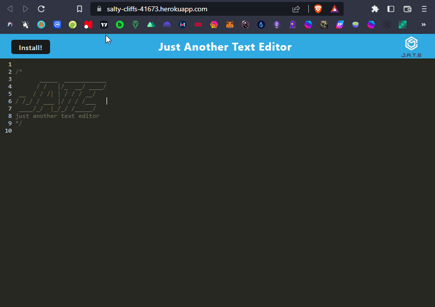

# JATE: PWA

## Description
       
Just another text editor that you can install and run offline

## Table of Contents
- [Installation](#installation-installation)
- [Usage](#usage-usage)
- [License](#license-license)
- [Contributing](#contributing-contributing)
- [Questions](#questions-questions)
        
## Installation {#installation}
        
To Install, click install button(wasn't able to get that to function)

## Usage {#usage}
        
To use visit url and enter text in the text editor
        
## License {#license}
        
MIT License
        
## Contributing {#contributing}
        
Don't contribute
            
## Questions {#questions}
If you have any questions, please feel free to contact me at Alex.horning.54@gmail.com 
or check out my GitHub profile at [Makeitouthill](https://github.com/Makeitouthill).